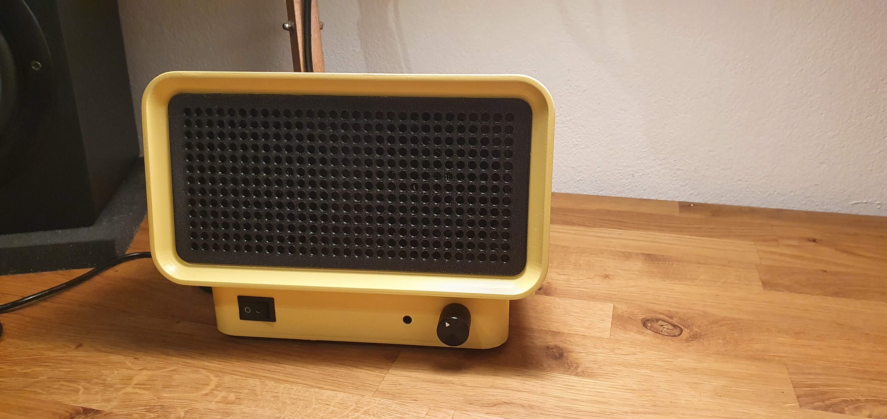
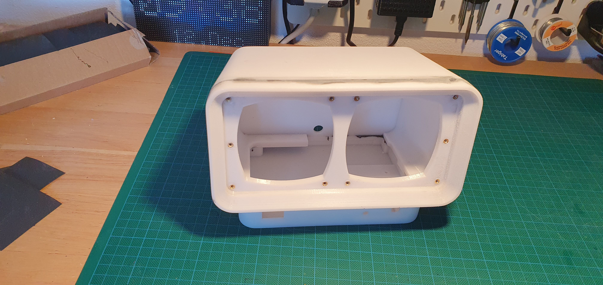
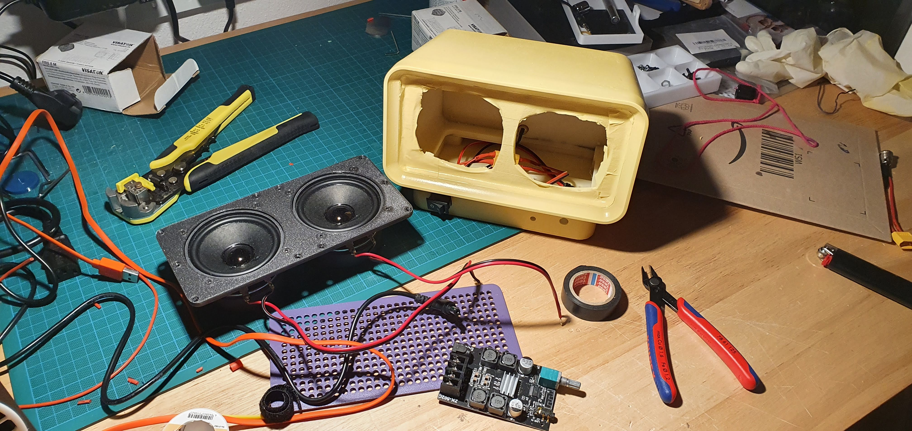
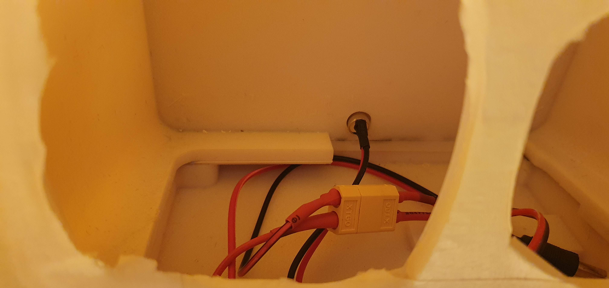
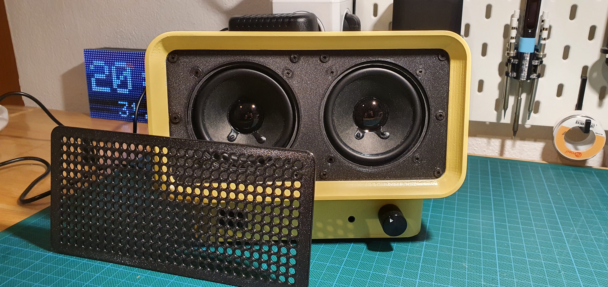
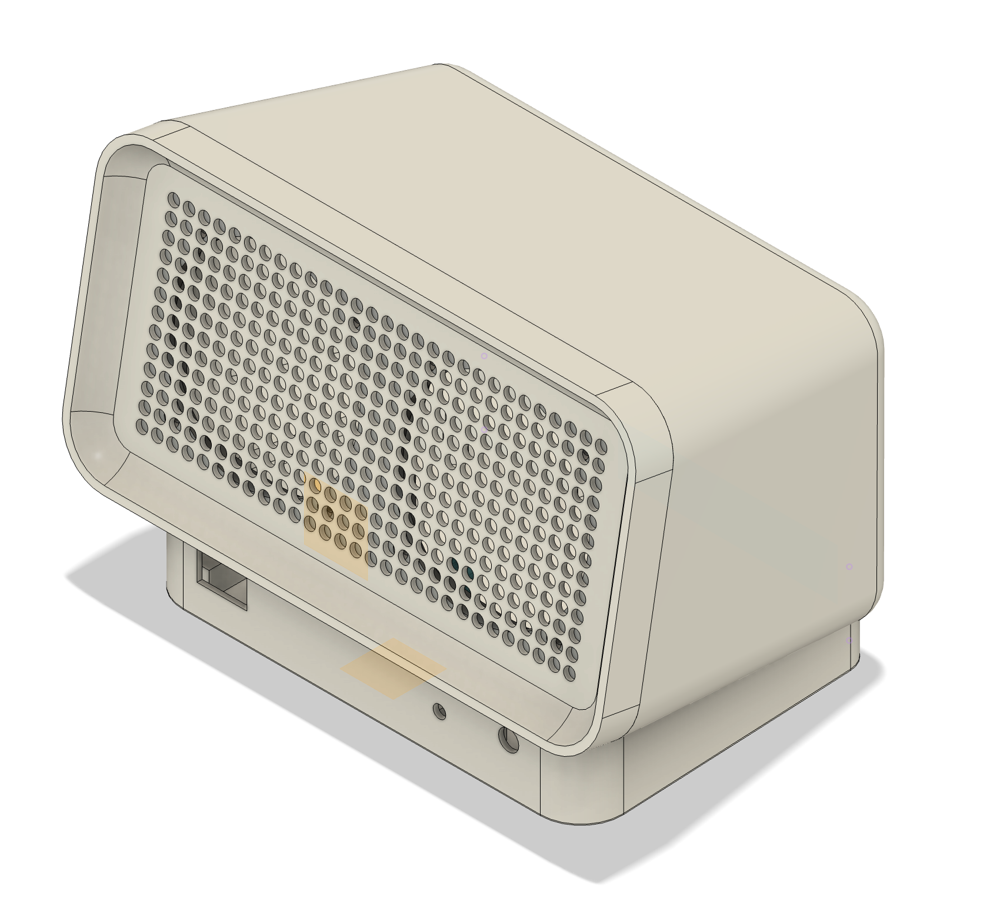
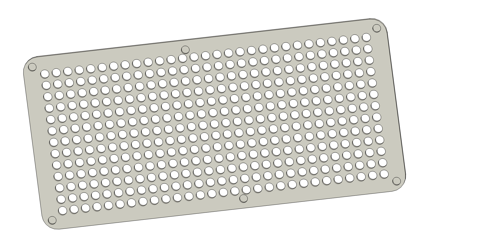

# retro-speaker

A 3d printed bluetooth speaker

## Materials

The amplifier is a 2x100W TPA3116 board. There are lots of different ones available on Amazon or AliExpress, just make sure the dimensions fit and it has an AUX input in the front. The exact model I've used isn't available on AliExpress any more, but [this one should be a good replacement](https://de.aliexpress.com/item/1005006744130939.html?spm=a2g0o.productlist.main.25.62a7f91ff8XP5L&algo_pvid=d2526900-fd57-49c5-9613-ecc1059de114&algo_exp_id=d2526900-fd57-49c5-9613-ecc1059de114-12&pdp_npi=4%40dis%21EUR%2140.95%2113.43%21%21%21311.63%21102.23%21%402103244417192525840134078e717f%2112000038163003950%21sea%21AT%21756049641%21&curPageLogUid=JsGL9nt6yQfp&utparam-url=scene%3Asearch%7Cquery_from%3A).

For the speakers I used a pair of [Viston FRS 8 M - 8 Ohm speakers](https://www.visaton.de/de/produkte/chassis/breitband-systeme/frs-8-m-8-ohm).

The power switch is a [KCD1-B1 rocker switch](https://www.hegxing.com.cn/product/rocker-switch-kcd1-b1/), which you can find pretty much anywhere.

In order to connect power I've used [these DC power connectors](https://www.amazon.de/gp/product/B089DXQDS9/ref=ppx_yo_dt_b_search_asin_title?ie=UTF8&psc=1)

The speakers are secured with a bunch of [M3 threaded inserts](https://www.amazon.de/ruthex-Gewindeeinsatz-St%C3%BCck-Gewindebuchsen-Kunststoffteile/dp/B08BCRZZS3/ref=sr_1_5?__mk_de_DE=%C3%85M%C3%85%C5%BD%C3%95%C3%91&crid=1AO1JIJ64V9UO&dib=eyJ2IjoiMSJ9.zGBFUoQho8HmNqbJaqYPtAWqfNBuDeDarmxgoAcjuw-h7RoprcXSK2hKHtImVzNl_gzAArRlmxT8Zy0w2LDgswfp7W4jSQwOwI5iN1F5f8Jv_ofuKxZw2d8MMfscxD0awIMPzaX5L6xXQrpfbix4zVNJPrRCYdTjhxkhqswOV0j6KCsWTO93oMgoXvwNy1Fq4ccZZyvAiU-gJKRHbD8VT22wrZE2G5cQiDGMJ3bRQkCSnDLLPc8VScXJ5Pd_70eQb5xLwBtEE8aez_iaEHJsAjb-dIYF8T5-GOBviLdMch0.3ZkhfcQB1qOetgIi4R9K6kgcnWIBCyHk2-PblJfMZmY&dib_tag=se&keywords=m3%2Bthreaded%2Binsert&qid=1719253193&sprefix=m4%2Bthreaded%2Binsert%2Caps%2C101&sr=8-5&th=1)

The for easy removal the speaker grill is attached with 6 [4x1mm neodym magnets](https://www.amazon.de/Wukong-Magnete-K%C3%BChlschrank-Drucker-DIY-Projekt/dp/B0CH1228D8/ref=sr_1_4?__mk_de_DE=%C3%85M%C3%85%C5%BD%C3%95%C3%91&crid=383L4L06WQ0QD&dib=eyJ2IjoiMSJ9.XZ22GcTQteD9ikKKWCFmHBDpvbPkKpnxh2w90PCDE1aKWSILvhJH1vZaTN2Ag0YFCqopGLxio3-Qo7_lQCdWgR7V9-rZ9j8E38Ks0CWAevbQvvJ4aOoV9-qLpHR3QWEJuOAbwalfD17K6L7PPFbHk1pT6uNbADO2T-m_Reo7-Psp1sBof6h6GdmwmYMOTV9ud_7hMepeQwmKpTX7sFfHgby25vh-DypWIsoIErsNQu7eKFc9szlTKAtCE_UDs1Cw1EQt3dGtRJ4TuFe93T103I3hSLNPU3kUG7Rx7UHlggg.IRRyEDBCugOH9UKWspswS_wYjbH_lBza9msmU8jeIPg&dib_tag=se&keywords=neodym+magnet+4mm+x+1mm&qid=1719254101&sprefix=neodym+magnet+4mm+x+1mm%2Caps%2C88&sr=8-4) which are glued in place. These magnets hold on to screws on the speaker.

## Print and build

The speaker housing is 3d printed and is split up into 5 separate parts. You can find them in the `/files/stl` directory.

I've printed them with a Prusa mk3s in 0.3mm layer height and PETG. (Some supports might be required for clean printing.)

After printing the `bottom`, `main-housing` and `front` parts need to be glued together. (I've used JBWeld)

M3 threaded inserts need to be inserted into the holes in order to secure the speakers.

I've also sanded, primed and spray painted the housing to give it a niced finish.

Here are a couple of pictures to better show the insides:

The main speaker parts after gluing together and inserting threaded inserts:

The housing, speakers and amplifier:

Internal power wiring:

Speaker with detached grill:

Fusion 360 model

Mounting holes for 4x1mm neodym magnets

